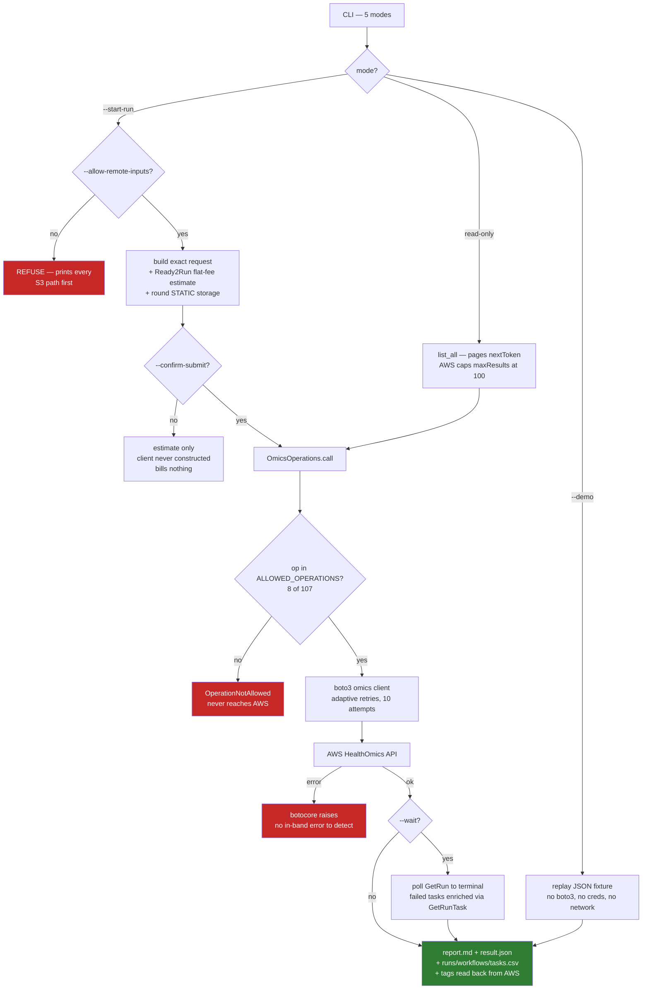

# healthomics-bridge vs. ClawBio's other platform bridges

Every number below was measured against this repository and, where marked
**live**, against real cloud services — nothing here is recalled or assumed.
Test counts come from `pytest --co`; line counts exclude tests.

**Scope note**: this skill is deliberately self-contained (see `SKILL.md`). This
comparison is against ClawBio's *other* cloud-platform bridges —
`galaxy-bridge`, `flow-bio`, `illumina-bridge` — and, as a different category,
the local Nextflow wrappers. It does not compare against or reference any
other AWS HealthOmics skill.

## Summary table

| | **healthomics-bridge** | **galaxy-bridge** | **flow-bio** | **illumina-bridge** |
|---|---|---|---|---|
| **Platform** | AWS HealthOmics | usegalaxy.org | Flow.bio | Illumina DRAGEN/ICA |
| **Transport** | boto3 → AWS API | bioblend SDK | REST (`requests`) | local FS + optional REST |
| **Auth** | AWS profile / IAM role | `GALAXY_API_KEY` | user+pass → JWT | optional `ILLUMINA_ICA_API_KEY` |
| **Credential handling** | resolved by boto3, never read/stored/forwarded | in-process bioblend | in-process `requests.Session` | in-process (metadata only) |
| **Causes billing / state change** | **yes** | yes (creates a history) | yes (creates sample/execution) | no |
| **Egress gate** (explicit ack before data leaves) | ✅ `--allow-remote-inputs` | ❌ | ❌ | n/a — local-first |
| **Cost gate** (second confirmation to spend) | ✅ `--confirm-submit` | ❌ | ❌ | n/a |
| **Cost gate states the cost** | ✅ priced from a dated snapshot | n/a | n/a | n/a |
| **Operation allowlist** | ✅ 8 of 107 API operations | n/a | n/a | n/a |
| **Errors** | botocore raises | raises | raises | raises |
| **`--demo` fully offline** | ✅ | ✅ | ❌ (live API call) | ✅ |
| **Live tests vs. real service** | ✅ 7, 2 need no network | ❌ | ❌ | ❌ |
| **Tests** | 53 (46 offline + 7 live) | 51 | 25 | 26 |
| **Python LOC** | 1,169 | 1,913 | 1,540 | 1,303 |

**The gate columns are the real story.** `healthomics-bridge` is the only one
of these four that (a) can spend real money and (b) makes both consequences —
data leaving the machine, and a charge — an explicit, separate confirmation.
`galaxy-bridge` and `flow-bio` create remote state (a Galaxy history, a Flow
sample) without an equivalent gate, because uploading a small file to a shared
academic instance and starting a $0.25–$20+ cloud compute run are different
risk classes. Neither is wrong for its own platform; the point is that
HealthOmics needed the stronger contract and got one.

## Data handling: where do the bytes go?

| | **healthomics-bridge** | **galaxy-bridge** | **flow-bio** | **illumina-bridge** |
|---|---|---|---|---|
| **Pattern** | reference passing | proxy relay | proxy relay | local-only |
| **Where inputs live** | already in S3 | local disk | local disk | local disk |
| **Data through the skill's own process** | **never** | yes — `bioblend` upload | yes — chunked upload | read-only, in place |
| **Holds storage credentials** | **no** | yes (API key) | yes (JWT) | no |
| **Uploads sample data** | no — AWS does the I/O | **yes** | **yes** | no |
| **Downloads results** | no — outputs stay in S3 | **yes** | no (metadata only) | n/a |
| **Can verify its own outputs** | **no — the report says so** | yes (downloaded) | partial | yes (local) |

`healthomics-bridge` never touches genomic bytes directly — it hands AWS a
URI and AWS does the I/O. That's *why* the run report is explicit about not
being able to checksum outputs: they never passed through this process, so
there is nothing here to hash. `galaxy-bridge` and `flow-bio` take the
opposite shape — the skill process is the pipe the bytes flow through — which
is why each of those needs different credentials (upload-capable) and a
different honesty story (they *can* verify what they moved, having moved it).

## This skill's own flow

## A different category: the local Nextflow wrappers

`nfcore-rnaseq-wrapper`, `nfcore-sarek-wrapper` and `nfcore-scrnaseq-wrapper`
aren't really comparable line-for-line — they run Nextflow itself (locally or
against whatever backend Nextflow is configured for), not a single hosted
platform's API, and their `--allow-remote-inputs` gate is a **pure policy
check that performs no I/O**: it inspects and permits or refuses URIs that get
passed to Nextflow verbatim, which stages them. Worth naming for one reason:
`healthomics-bridge` and the nf-core wrappers independently converged on the
same flag name and the same fail-closed default for the same problem — sending
genomic data somewhere the user didn't explicitly say to send it. That
convergence, not the numeric comparison, is the useful data point.

## Evidence this table rests on

Every claim about `healthomics-bridge` above traces to a real, live-executed
run, not to its own tests:

- **Ready2Run**: ESMFold submitted with `--start-run --workflow-type
  READY2RUN`, completed, produced a real predicted structure (`pLDDT 74.6`)
  and a real cost ($0.25, the flat Ready2Run fee).
- **Private workflow**: a minimal WDL registered, containerised for the
  correct architecture, submitted with `--workflow-type PRIVATE --wait`,
  completed, and its S3 output verified to contain the exact string passed in
  as a parameter.
- **A rejected submission**: deliberately pointed at an input the execution
  role could not read. Failed before billing, as an exception — not as data.
- **Two real failures, both diagnosed through this skill's own report**: a
  container built for the wrong CPU architecture, and a missing ECR
  repository policy. Both are now documented in `SKILL.md`'s Gotchas with the
  exact fix.
