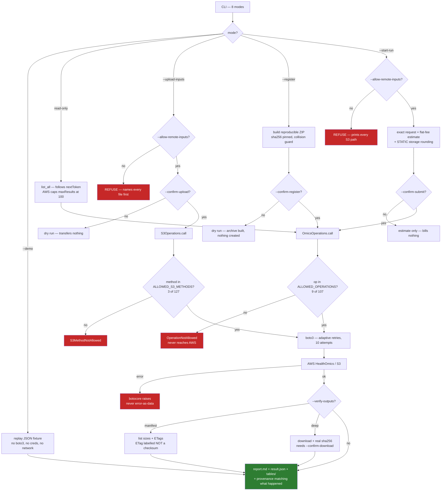

# healthomics-bridge vs. ClawBio's other platform skills

Every figure below was **measured against this repository**, not recalled. Test
counts come from `pytest --co`; line counts exclude tests; capability columns
come from grepping the actual source. Where a claim is about live behaviour it
is marked **live** and traces to a command actually executed against the real
service.

**Scope note**: this skill is deliberately self-contained (see `SKILL.md`). This
compares it against ClawBio's other credential-holding platform bridges. It does
not compare against or reference any other AWS HealthOmics skill.

## Who is in the peer group, and why

A "platform skill" here means one that **holds a credential for an external
service and acts on it**. Discovered by scanning every skill in the repo for
credential environment variables rather than assuming a list:

| Credential | Skill | Platform |
|---|---|---|
| `AWS_PROFILE` / IAM | **healthomics-bridge** | AWS HealthOmics |
| `GALAXY_API_KEY` | galaxy-bridge | usegalaxy.org |
| `FLOW_USERNAME` / `FLOW_TOKEN` | flow-bio | Flow.bio |
| `ILLUMINA_ICA_API_KEY` | illumina-bridge | Illumina DRAGEN / ICA |
| `LABSTEP_API_KEY` | labstep | Labstep ELN |
| `PROTOCOLS_IO_ACCESS_TOKEN` | protocols-io | protocols.io |

Deliberately excluded: read-only public-data fetchers (`pubmed-summariser`,
`gwas-lookup`, `clinpgx`, the `*-region-fetch` family) hold no platform
credential and cause no remote state; local-MCP skills (`just-prs-mcp`,
`bioqc-mcp`) spawn a child process rather than call a service; and the
`nfcore-*-wrapper` family drives Nextflow itself, treated separately below.

## The split that actually matters: does it change remote state?

| | Writes remote state | What it creates |
|---|---|---|
| **healthomics-bridge** | **yes — billable** | runs, workflows, S3 objects |
| galaxy-bridge | **yes** | histories, tool executions |
| flow-bio | **yes** | samples, pipeline executions |
| illumina-bridge | no | reads a local bundle; optional ICA metadata |
| labstep | no | queries only |
| protocols-io | no | search and retrieve only |

Only three of six can change anything on the far side. That is the group where
gating matters, and it is the group `healthomics-bridge` belongs to.

## Full comparison

| | **healthomics-bridge** | **galaxy-bridge** | **flow-bio** | **illumina-bridge** | **labstep** | **protocols-io** |
|---|---|---|---|---|---|---|
| **Platform** | AWS HealthOmics | usegalaxy.org | Flow.bio | Illumina ICA | Labstep | protocols.io |
| **Transport** | boto3 (omics + S3) | bioblend SDK | `requests` | local FS + REST | labstepPy | REST |
| **Auth** | IAM / profile | API key | user+pass → JWT | API key | API key | client token |
| **Credential handling** | resolved by boto3, never read or stored | in-process bioblend | in-process `Session` | in-process | in-process | in-process |
| **Causes billing** | **yes** | no (shared instance) | plan-dependent | no | no | no |
| **Egress gate** | ✅ `--allow-remote-inputs` | ❌ | ❌ | n/a | n/a | n/a |
| **Action gate** | ✅ four `--confirm-*` flags | ❌ | ❌ | n/a | n/a | n/a |
| **Cost gate states the cost** | ✅ priced snapshot | n/a | n/a | n/a | n/a | n/a |
| **Call allowlist** | ✅ 9/107 omics + 3/127 S3 | ❌ | ❌ | ❌ | ❌ | ❌ |
| **Errors raise, never returned as data** | ✅ | ❌ one in-band `{"error": …}` | ✅ | ✅ | ✅ | ✅ |
| **Retry / backoff configured** | ✅ adaptive, 10 attempts | ❌ | ❌ | ❌ | ❌ | ✅ |
| **Paginates (follows tokens)** | ✅ | ❌ | ❌ | ❌ | ❌ | ❌ |
| **`--demo` fully offline** | ✅ needs no boto3 | ✅ | ❌ live call, cache fallback | ✅ | ✅ | ✅ |
| **Live tests vs. real service** | ✅ 7 | ❌ | ❌ | ❌ | ❌ | ❌ |
| **Repro bundle w/ checksums** | ✅ | ✅ | ❌ | ✅ | ❌ | ✅ |
| **Verifies its own outputs** | ✅ manifest or real SHA-256 | ❌ | ❌ | ✅ local | n/a | n/a |
| **Registers a workflow definition** | ✅ WDL / CWL / Nextflow | ❌ runs published tools | ❌ preconfigured | n/a | n/a | n/a |
| **Tests** | **110** | 51 | 25 | 26 | 45 | 61 |
| **Python LOC** | 2,329 | 1,913 | 1,540 | 1,303 | 574 | 830 |
| **SKILL.md lines** | 492 | 224 | 258 | 164 | 289 | 178 |

## What the table says, honestly

**Where this skill is genuinely ahead.** It is the only one of the six with a
call allowlist, an egress gate, an action gate, configured retries, pagination,
live tests, or output verification.

That is not a fair fight, and the reason is the "Causes billing" row: it is the
only one where a mistake spends real money in a cloud account someone owns.
`galaxy-bridge` runs on a shared academic instance; `labstep` and
`protocols-io` read a notebook and a protocol library. **The gates exist
because the consequences differ, not because the other skills are careless.**

**Where the others are better shaped.** `labstep` does its job in 574 lines
against this skill's 2,329 — a 4× difference for a read-only API needing no
gating, no allowlist and no provenance ceiling. `protocols-io` gets 61 tests
from 830 lines, the best test-to-code density in the group, and is the only
other skill configuring retry behaviour. Smaller is the correct answer for a
skill that cannot break anything, and this skill's size is a cost of its
blast radius, not a virtue.

**Two real weaknesses this survey found in the others** — named because they
are exactly the failure modes this skill was built to avoid:

- **`galaxy-bridge` returns one error as data** (`{"status": "error", …}`)
  rather than raising, so a failed tool run can flow downstream looking like a
  result. It also purges its own Galaxy history in a `finally` with a bare
  `except: pass`. The intent is right — tidy up after yourself — but a failed
  cleanup is silent, leaving orphaned remote state nobody is told about.
- **`flow-bio`'s `--demo` is not offline.** It constructs a client, attempts a
  login, and only falls back to a bundled cache if that fails. A demo that
  reaches the network cannot evaluate the skill on a locked-down machine, and
  it is the one skill here whose demo can behave differently between two runs.

**One place this skill is not really ahead.** Nothing but
`healthomics-bridge` paginates, but only it and `galaxy-bridge` handle result
sets large enough for that to matter. For `labstep` and `protocols-io` the
absence is a reasonable call, not a gap.

## This skill's own flow

## A different category: the local Nextflow wrappers

`nfcore-rnaseq-wrapper` (7,121 LOC), `nfcore-sarek-wrapper` (10,400) and
`nfcore-scrnaseq-wrapper` (7,322) are not line-for-line comparable: they drive
Nextflow itself rather than one hosted platform's API, and their
`--allow-remote-inputs` is a **pure policy check performing no I/O** — it
inspects URIs and permits or refuses, then hands them to Nextflow verbatim to
stage.

Worth naming for one reason: `healthomics-bridge` and those wrappers
independently reached the same flag name and the same fail-closed default for
the same problem — genomic data going somewhere the user did not say to send
it. That convergence is the useful signal, not the size difference.

## Evidence this rests on

Every capability claim about `healthomics-bridge` traces to a live-executed
run, not to its own tests. [EXAMPLE.md](EXAMPLE.md) shows the captured output
of each step:

- **Ready2Run**: ESMFold submitted, completed, produced a real predicted
  structure (`pLDDT 74.6`) at the published flat fee ($0.25).
- **Private workflow**: WDL registered, run submitted, `COMPLETED`, output
  verified to contain the exact string passed as a parameter.
- **The full loop**: upload → register → submit → verify → download, through
  this skill alone, no AWS CLI. An independent `shasum -a 256` matched the
  SHA-256 the skill reported.
- **A rejected submission**: pointed at an input the execution role could not
  read. Failed before billing, as an exception — not as data.
- **Two real failures diagnosed through the skill's own report**: wrong
  container architecture, and a missing ECR repository policy. Both in
  [GOTCHAS.md](GOTCHAS.md) with the exact fix.
